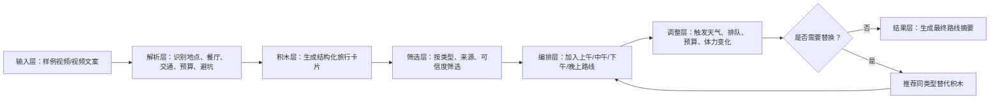
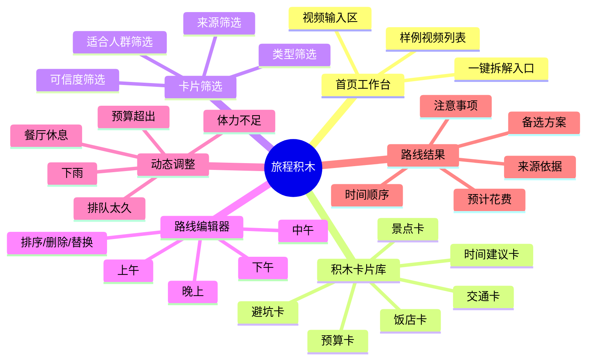
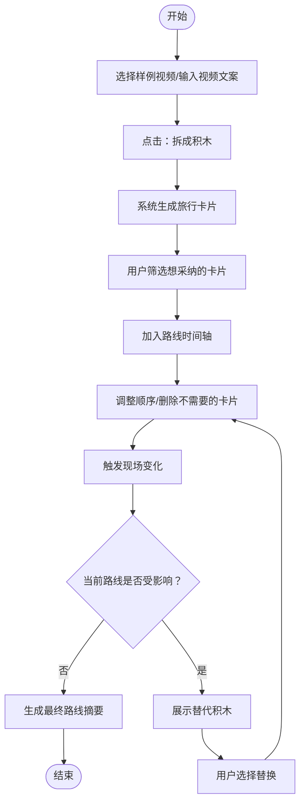
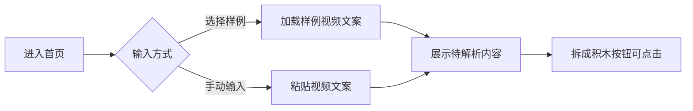
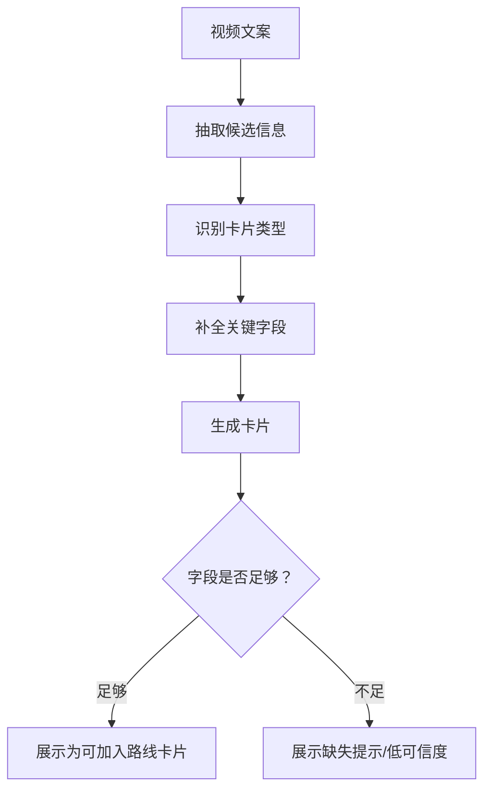
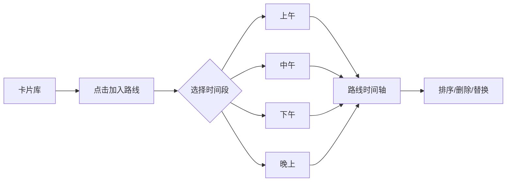
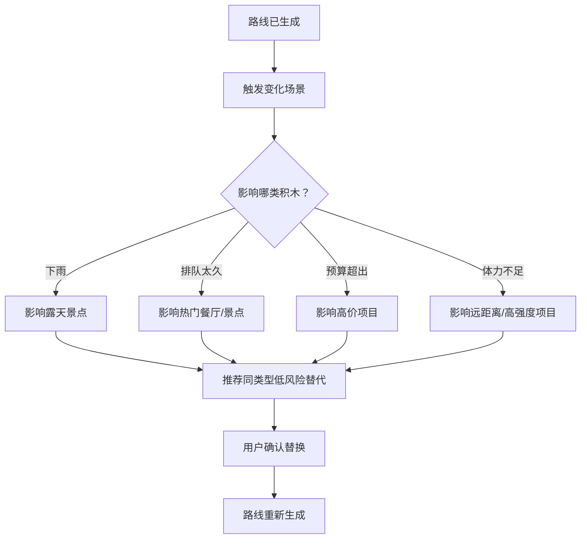
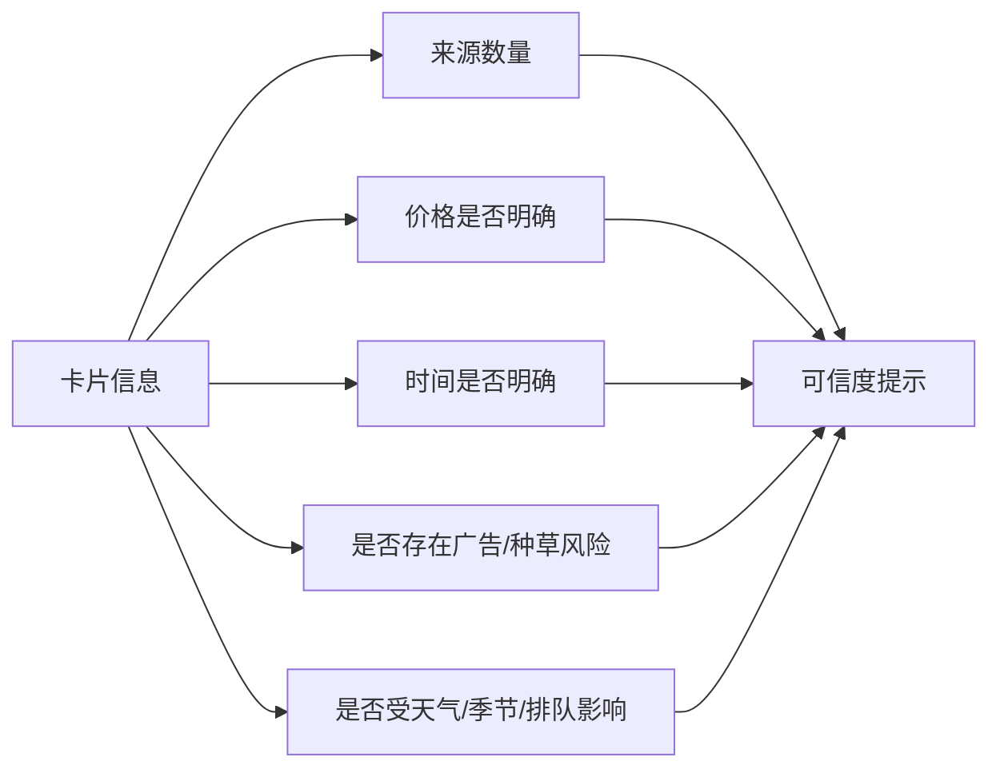
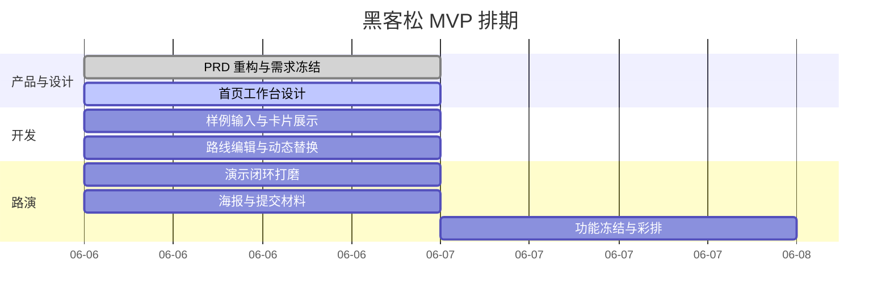

# 旅程积木 PRD

## 变更记录

| 修订内容 | 版本 | 作者 | 日期 |
| --- | --- | --- | --- |
| 完成初版问题洞察、产品定位、MVP 范围与路演材料 | V1.0 | 产品 | 2026-06-06 |
| 按 PRD 模板重构文档结构，新增产品逻辑图、信息架构图、需求流程图与优先级 | V1.1 | Codex | 2026-06-06 |

## 1. 背景介绍

### 1.1 业务背景

现在很多人做旅行攻略的第一步是刷短视频。短视频解决了“想去哪”的问题，却没有很好解决“怎么去、怎么排、怎么改”的问题。

旅游攻略视频本身很好看、很好收藏，但并不天然适合执行。视频通常按照博主的叙事顺序展开，而用户真正做旅行决策时，需要按照景点、饭店、交通、预算、避坑、时间安排等模块来拆解、比较和重组。

核心问题不是用户缺少旅游内容，而是用户缺少一个把零散视频信息转化成个人路线的工具。

### 1.2 业务场景

| 场景/商业模式 | 用户问题 | 产品机会 |
| --- | --- | --- |
| 短视频种草 | 视频内容好看，但信息线性、分散、难执行 | 将视频内容拆成可筛选、可比较的结构化卡片 |
| 自由行攻略 | 用户需要自己截图、查地图、看评论、整理路线 | 帮用户把多来源信息拼成自己的路线 |
| 旅行现场调整 | 天气、排队、预算、体力变化会打乱计划 | 提供局部替换能力，而不是重做整份攻略 |
| 黑客松 Demo | 评委需要快速理解产品亮点 | 用“视频 -> 积木 -> 路线 -> 替换”的闭环讲清楚价值 |

### 1.3 问题洞察

| 洞察 | 用户当前状态 | 产品需要解决 |
| --- | --- | --- |
| 视频是线性的，旅行决策是模块化的 | 景点、饭店、交通、预算散落在不同片段 | 把视频拆成卡片 |
| 博主路线不等于我的路线 | 同一个推荐点对不同用户适用性不同 | 让用户选择适合自己的积木 |
| 信息很多，但可采纳信息少 | 用户被镜头、情绪、标题话术淹没 | 提取可执行字段 |
| 视频给结论，但用户需要依据 | 用户不敢完全相信单条视频 | 展示来源、价格、风险和可信度 |
| 旅行计划是动态的 | 下雨、排队、闭店、预算超支都会改变路线 | 支持局部替换和路线重组 |

## 2. 产品概述

### 2.1 产品定位

在短视频旅行攻略场景下，旅程积木是一款把旅游攻略视频拆成可验证、可筛选、可拖拽信息模块的路线生成工具。

用户可以从多条视频中提取景点、饭店、交通、预算、避坑等卡片，把真正想采纳的信息像搭积木一样拼成自己的旅行路线，并在现场变化时快速替换局部行程。

### 2.2 服务对象

| 用户类型 | 典型特征 | 核心诉求 |
| --- | --- | --- |
| 自由行准备用户 | 旅行前收藏大量短视频、截图、查地图 | 快速把视频变成可执行路线 |
| 短视频种草用户 | 刷到想去的内容，但懒得从零整理 | 判断这条视频对自己有没有用 |
| 多人出行用户 | 需要和朋友讨论取舍 | 用卡片化信息降低讨论成本 |
| 黑客松评委/体验者 | 时间短，需要快速理解产品 | 30 秒内看到完整演示闭环 |

### 2.3 核心价值主张

一句话介绍：把旅游攻略视频拆成可拖拽的旅行积木，帮用户从零散内容拼出自己的路线。

路演版表达：旅行视频解决了“想去哪”的问题，却没有解决“怎么去、怎么排、怎么改”的问题。旅程积木把视频里的景点、饭店、交通、预算和避坑信息拆成可筛选、可替换、可重组的卡片，让用户从多个视频里挑出真正适合自己的内容，拼成一条可执行路线。

### 2.4 产品逻辑

### 2.5 信息架构

### 2.6 角色术语

| 术语 | 定义 | 示例 |
| --- | --- | --- |
| 旅行积木 | 从视频内容中提取出的可组合信息卡片 | 景点卡、饭店卡、避坑卡 |
| 卡片库 | 存放所有可采纳旅行积木的区域 | 可按类型、来源、可信度筛选 |
| 路线时间轴 | 用户把卡片编排成行程的区域 | 上午、午餐、下午、晚上 |
| 动态替换 | 当现场条件变化时，用替代卡片替换原卡片 | 下雨时将露天景点替换为室内展馆 |
| 可信度提示 | 帮用户判断信息可靠性的依据展示 | 多视频提及、价格明确、存在排队风险 |

## 3. 需求说明

### 3.1 需求列表

| ID | 需求 | 模块 | 目标 | 优先级 |
| --- | --- | --- | --- | --- |
| R1 | 支持选择样例视频或输入视频文案 | 视频输入 | 让用户提供旅行攻略内容来源 | P0 |
| R2 | 支持一键拆解视频信息 | 信息拆解 | 把非结构化内容转成旅行积木 | P0 |
| R3 | 展示结构化旅行卡片 | 卡片库 | 让用户看到景点、饭店、交通、预算、避坑 | P0 |
| R4 | 支持将卡片加入路线时间轴 | 路线编辑 | 让用户拼出自己的旅行路线 | P0 |
| R5 | 支持路线卡片排序、删除、替换 | 路线编辑 | 让路线可调整、可重组 | P0 |
| R6 | 支持触发旅行变化场景 | 动态调整 | 展示“积木可替换”的产品差异点 | P0 |
| R7 | 展示替代积木推荐 | 动态调整 | 降低用户现场调整成本 | P1 |
| R8 | 展示卡片来源和可信度提示 | 可信度 | 帮用户判断推荐是否可采纳 | P1 |
| R9 | 生成最终路线摘要 | 路线结果 | 输出可读、可展示的路线结果 | P0 |
| R10 | 支持多视频聚合对比 | 多来源聚合 | 从多个视频中组合更适合用户的路线 | P2 |

### 3.2 需求总流程图

### 3.3 R1 视频信息输入

用户可以从内置样例中选择旅游视频内容，也可以输入一段旅游视频文案。MVP 阶段优先使用静态样例，不做真实短视频平台接入。

| 字段 | 说明 |
| --- | --- |
| 样例标题 | 用于区分不同视频类型，如美食、景点、避坑、一日游 |
| 视频文案 | 待拆解的非结构化内容 |
| 来源标识 | 标记卡片来自哪条视频 |
| 内容状态 | 未选择、已选择、可解析、解析中、解析完成 |

### 3.4 R2/R3 信息拆解与卡片展示

系统将输入内容拆解成结构化旅行卡片。每张卡片都应该帮助用户判断“是否值得加入我的路线”，而不是只做内容摘要。

| 卡片类型 | 必填字段 | 建议展示 |
| --- | --- | --- |
| 景点卡 | 名称、推荐理由、适合人群 | 建议时段、门票/预算、风险 |
| 饭店卡 | 名称、菜品/特色、人均 | 距离、排队风险、替代餐厅 |
| 交通卡 | 起点、终点、方式 | 用时、费用、复杂度 |
| 预算卡 | 项目、金额 | 是否可选、是否易超支 |
| 避坑卡 | 风险点、触发条件 | 规避建议、影响程度 |
| 时间建议卡 | 时间段、适合活动 | 是否受天气/排队影响 |

### 3.5 R4/R5 路线编辑

用户可以将卡片加入路线，并按时间段组织。路线编辑器是产品核心交互，需要优先保证稳定、直观、可演示。

| 操作 | 规则 | 优先级 |
| --- | --- | --- |
| 加入路线 | 卡片可以加入指定时间段 | P0 |
| 调整顺序 | 同一时间段内支持排序 | P0 |
| 删除卡片 | 删除后不影响卡片库原卡片 | P0 |
| 替换卡片 | 替换后保留时间段位置 | P0 |
| 自动校验 | 提示预算超出、时间冲突、风险叠加 | P2 |

### 3.6 R6/R7 动态替换

动态替换是“旅程积木”区别于普通攻略总结工具的关键。它要表达：旅行计划不是一次性生成，而是可以随时拆、换、重组。

| 变化场景 | 替代推荐规则 | Demo 建议 |
| --- | --- | --- |
| 下雨 | 优先推荐室内、距离近、同类型体验 | 露天景点替换为博物馆/商场 |
| 排队 2 小时 | 优先推荐附近、排队风险低的同类卡片 | 网红餐厅替换为附近小店 |
| 预算超出 | 优先推荐低预算卡片 | 高价体验替换为免费景点 |
| 时间不够 | 优先删除低优先级或远距离卡片 | 压缩下午路线 |
| 朋友走累了 | 优先推荐休息、短距离、低体力项目 | 步行路线替换为咖啡馆休息 |

### 3.7 R8 可信度提示

系统不直接替用户判断“绝对可信”，而是展示判断依据。MVP 阶段不承诺实时真实，只表达“这条信息是否更值得采纳”。

| 提示类型 | 示例文案 |
| --- | --- |
| 来源增强 | “2 条视频都提到该地点” |
| 信息缺失 | “未提到明确价格，建议现场确认” |
| 风险提醒 | “评论区常见排队反馈，建议避开饭点” |
| 适用性提醒 | “更适合拍照打卡，不一定适合亲子出行” |

### 3.8 R9 最终路线展示

系统生成一份可读的路线摘要，用于用户执行、路演展示和截图提交。

| 展示内容 | 说明 |
| --- | --- |
| 时间顺序 | 上午/中午/下午/晚上 |
| 地点/餐厅名称 | 来自用户已选择卡片 |
| 预计花费 | 汇总可识别预算 |
| 注意事项 | 展示避坑和风险提示 |
| 备选方案 | 展示可替换卡片 |
| 来源依据 | 标记来自哪条视频或样例 |

## 4. 非功能需求

| 类型 | 需求 |
| --- | --- |
| 易理解性 | 用户进入页面后，应在 10 秒内理解“视频拆成积木”的概念 |
| 演示效率 | 黑客松演示闭环应控制在 30 秒内 |
| 可编辑性 | 用户应能手动调整卡片和路线，避免 AI 抽取错误导致不可用 |
| 稳定性 | MVP 优先保证核心路径稳定，不追求复杂动画和真实 API |
| 数据真实性 | MVP 使用样例数据，不承诺价格、营业状态、排队信息实时准确 |

## 5. MVP 范围

### 5.1 必须包含

- 一个可打开的页面。
- 一个清晰的旅游视频信息输入区。
- 一个“拆成积木”的核心动作。
- 一组结构化旅行卡片，包括景点、饭店、交通、预算、避坑。
- 一个可拖拽或可点击组合的路线编辑区。
- 一个能体现“计划变化后替换积木”的交互。
- 一个可展示的最终路线结果。

### 5.2 可以简化

- 视频解析可以先用预设样例文本或模拟数据，不要求真实接入短视频平台。
- 地图距离可以用静态距离或标签展示，不要求真实地图 API。
- 价格和营业状态可以用样例数据表达，不要求实时联网查询。
- 多视频聚合可以先用 2-3 条样例视频表现，不要求大规模内容抓取。
- AI 解析可以用前端模拟，重点展示“视频信息被拆成积木”的结果。

### 5.3 不应该做

- 不做完整账号体系。
- 不做真实短视频爬取。
- 不做复杂社交分享。
- 不做完整商业化。
- 不做全城市覆盖。
- 不做复杂行程预订交易。

## 6. 人员与排期

| 角色 | 工作内容 |
| --- | --- |
| 产品 | 明确 Demo 闭环、需求优先级、路演话术 |
| 设计 | 完成首页工作台、卡片、路线时间轴、替换弹窗 |
| 前端 | 实现样例输入、卡片展示、路线编辑、动态替换 |
| 数据/AI | 准备样例数据和模拟解析结果 |
| 运营/路演 | 准备海报、30 秒讲解词、体验引导 |

## 7. 验收标准

| 验收项 | 标准 |
| --- | --- |
| 内容输入 | 用户可以选择或输入一段旅游攻略内容 |
| 信息拆解 | 用户点击后可以看到结构化旅行卡片 |
| 卡片覆盖 | 卡片至少覆盖景点、饭店、交通、预算、避坑五类信息 |
| 路线编辑 | 用户可以把卡片加入一条时间轴路线 |
| 路线调整 | 用户可以调整顺序、删除卡片、替换卡片 |
| 动态变化 | 用户可以触发至少一种旅行变化场景 |
| 替代方案 | 用户可以为受影响的卡片选择替代方案 |
| 结果展示 | 系统可以展示更新后的路线和最终路线摘要 |
| 来源依据 | 系统可以展示每张卡片的来源或可信度提示 |

## 8. 成功指标

### 8.1 黑客松指标

- 体验者能在 30 秒内理解“视频变路线”的核心概念。
- 评委能听懂“旅游视频好看不好用”的问题洞察。
- Demo 能展示至少一次从视频拆解到路线生成的完整流程。
- Demo 能展示至少一次动态替换，体现“积木”的独特性。
- 海报和路演文案可以直接复用 PRD 中的一句话介绍和问题陈述。

### 8.2 产品指标

- 用户从一条视频中提取可用信息的时间明显减少。
- 用户能从多条视频中选择并组合自己的路线。
- 用户能在计划变化时快速替换局部行程，而不是重做整份攻略。
- 用户能看到推荐依据和风险提示，而不是只看到主观结论。

## 9. 路演材料

### 9.1 路演问题陈述

现在很多人做旅行攻略的第一步是刷短视频，但旅游攻略视频其实“好看不好用”。景点、饭店、交通、预算和避坑信息分散在不同片段里，单条视频又往往带有博主个人体验和主观推荐，用户很难判断哪些信息真的适合自己。更重要的是，旅行计划经常会因为天气、排队、预算、体力和交通变化被打乱，所以用户真正需要的不是一条固定攻略，而是一组可以筛选、替换和重新组合的信息模块。

因此我们做旅程积木：把旅游攻略视频拆成可拖拽的景点、饭店、交通、预算和避坑卡片，让用户从不同视频里挑出真正想采纳的信息，像搭积木一样拼出自己的路线。

### 9.2 30 秒讲解词

我们发现，大家做旅行攻略时很爱刷短视频，但短视频其实好看不好用。视频里有景点、饭店、交通、预算和避坑信息，可这些信息都散落在不同片段里，而且很多内容是博主个人体验，用户还要自己截图、收藏、查地图、看评论，最后重新整理成路线。

所以我们做了旅程积木。它可以把旅游攻略视频拆成一张张可拖拽的旅行卡片，用户只需要挑出真正适合自己的景点、饭店和避坑信息，就能拼成自己的路线。现场如果下雨、排队太久或者预算超了，也可以像换积木一样替换其中一个点，而不是重做整份攻略。

### 9.3 1 分钟讲解词

现在很多人做旅行攻略的第一步是刷短视频。短视频很好看，也很容易种草，但真正要出发时，用户会发现它不好直接执行。因为视频是按博主叙事讲的，而旅行决策需要模块化信息：景点在哪里，饭店多少钱，交通怎么走，有没有排队、闭店、限流这些坑。

更麻烦的是，单条视频往往只是博主的一次个人体验，不一定适合每个用户。用户最后会看很多条视频，收藏很多内容，截图，查地图，看评论，再重新写一份自己的攻略。而到了现场，计划还会因为天气、预算、体力、排队和交通变化被打乱。

旅程积木想解决的就是这个问题。我们把旅游攻略视频拆成可筛选、可验证、可拖拽的积木卡片，包括景点、饭店、交通、预算和避坑。用户可以从多条视频里挑出真正想采纳的信息，拼成自己的路线。当现场情况变化时，也可以替换其中一个积木，路线自动调整。

我们不是再做一条攻略，而是帮助用户把别人的旅行视频，变成自己的可执行路线。

## 10. 风险与约束

| 风险 | 说明 | 应对 |
| --- | --- | --- |
| 数据真实性风险 | 价格、营业状态、排队情况可能过期 | MVP 通过可信度提示表达，不承诺实时真实 |
| AI 抽取准确性风险 | 地点识别、价格抽取、主观评价可能误判 | 允许用户手动编辑卡片 |
| 演示复杂度风险 | 功能过多会冲淡核心亮点 | 聚焦“拆、拼、换”三个动作 |
| 时间约束 | 黑客松时间有限 | 优先保证能玩的 Demo，而不是完整产品 |

## 11. 后续版本

- 接入真实短视频链接解析。
- 支持多条视频自动合并和冲突提示。
- 接入地图，计算距离和通勤时间。
- 接入天气，自动推荐室内替代方案。
- 接入营业时间和排队信息。
- 支持多人协作投票选点。
- 支持路线导出为图片、PDF 或分享链接。
- 支持用户偏好，包括预算、体力、口味、亲子、情侣、拍照、文化体验等。

## 12. 进一步修改建议

| 位置 | 建议 | 原因 |
| --- | --- | --- |
| 产品定位 | 增加“短视频旅行攻略场景”限定 | 避免产品边界扩散成通用旅行规划工具 |
| 需求说明 | 将功能需求改成“需求列表 + 单需求流程图” | 更符合 PRD 阅读习惯，研发更容易拆任务 |
| 信息架构 | 用首页工作台、卡片库、路线编辑器、动态调整、路线结果分层 | 能清楚表达页面和模块关系 |
| 动态替换 | 把它设为 P0 演示能力 | 这是产品差异点，不应放到后续版本 |
| 可信度提示 | 不承诺“信息正确”，只展示判断依据 | MVP 更可信，也能规避数据真实性风险 |
| 多视频聚合 | 当前建议降为 P2 | 黑客松阶段容易做复杂，先用样例表达即可 |
