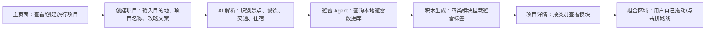
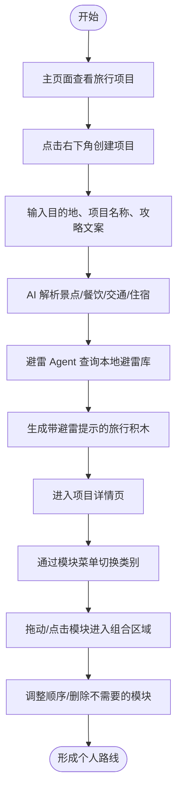
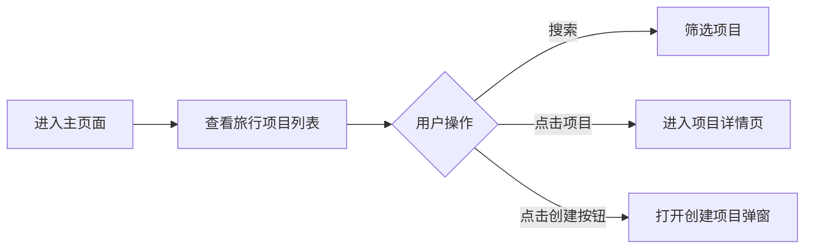
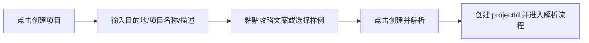
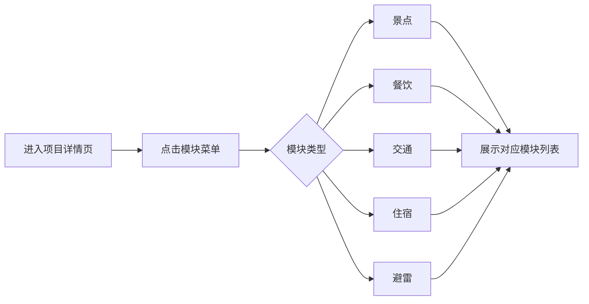
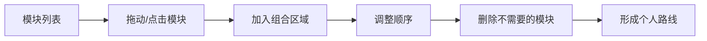
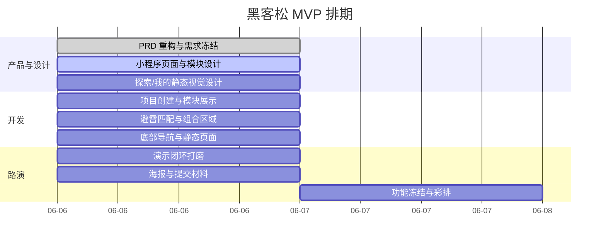

# 旅程避雷积木 PRD

## 变更记录

| 修订内容 | 版本 | 作者 | 日期 |
| --- | --- | --- | --- |
| 完成初版问题洞察、产品定位、MVP 范围与路演材料 | V1.0 | 产品 | 2026-06-06 |
| 按 PRD 模板重构文档结构，新增产品逻辑图、信息架构图、需求流程图与优先级 | V1.1 | Codex | 2026-06-06 |
| 新增 UI 低保真方案，补充各需求实现方式与技术支持 | V1.2 | Codex | 2026-06-06 |
| 将 UI 低保真调整为手机小程序形态，补充页面清单与单页线框 | V1.3 | Codex | 2026-06-06 |
| 按项目化小程序方向重构定位、页面、需求和 MVP 边界 | V1.4 | Codex | 2026-06-06 |
| 补充探索页和我的页的 MVP 静态视觉规划 | V1.5 | Codex | 2026-06-06 |

## 1. 背景介绍

### 1.1 业务背景

现在很多人做旅行攻略的第一步是刷短视频。短视频解决了“想去哪”的问题，却没有很好解决“值不值得去、会不会踩坑、怎么把信息变成自己的路线”的问题。

旅游攻略视频本身很好看、很好收藏，但并不天然适合执行。视频通常按照博主的叙事顺序展开，而用户真正做旅行决策时，需要按照景点、餐饮、交通、住宿和避雷信息来拆解、比较和重组。

核心问题不是用户缺少旅游内容，而是用户缺少一个把网红攻略拆成可移动模块，并把踩雷信息挂到模块上的工具。

### 1.2 业务场景

| 场景/商业模式 | 用户问题 | 产品机会 |
| --- | --- | --- |
| 短视频种草 | 视频内容好看，但地点、店铺、住宿和交通信息分散 | 将视频内容拆成可移动的结构化模块 |
| 反网红踩雷 | 用户到现场才发现人挤人、照骗、隐形消费、交通不便 | 用避雷数据库给每个模块挂风险提示 |
| 自由行攻略 | 用户需要自己截图、查地图、看评论、整理路线 | 让用户在项目中自由拼接自己的路线 |
| 黑客松 Demo | 评委需要快速理解产品亮点 | 用“AI 拆攻略 + Agent 查避雷 + 用户拼路线”讲清楚价值 |

### 1.3 问题洞察

| 洞察 | 用户当前状态 | 产品需要解决 |
| --- | --- | --- |
| 视频是线性的，旅行决策是模块化的 | 景点、餐饮、交通、住宿散落在不同片段 | 把视频拆成四类积木 |
| 网红推荐不等于真实体验 | 用户到现场才发现排队、照骗、消费坑 | 用避雷库补充风险信息 |
| 信息很多，但可采纳信息少 | 用户被镜头、情绪、标题话术淹没 | 提取可执行字段 |
| 视频给结论，但用户需要判断依据 | 用户不敢完全相信单条视频 | 展示避雷标签和避雷详情 |
| 用户想自己决定路线 | 自动规划可能不符合个人偏好 | 提供可移动模块，让用户自己拼路线 |

## 2. 产品概述

### 2.1 产品定位

在短视频旅行攻略场景下，旅程避雷积木是一款把网红旅行攻略视频拆成可移动模块，并自动匹配避雷信息的小程序。

它不自动替用户规划路线，也不推荐替代方案。它只做一件核心事情：用户创建一个旅行项目后，系统把攻略文案里零散的旅行信息拆成“景点、餐饮、交通、住宿”四类积木，并把数据库里的避雷内容挂到每个积木上。用户再进入项目详情页，自己拖动这些积木，拼出属于自己的路线。

### 2.2 服务对象

| 用户类型 | 典型特征 | 核心诉求 |
| --- | --- | --- |
| 自由行准备用户 | 旅行前收藏大量短视频、截图、查地图 | 快速把视频信息拆成可用模块 |
| 短视频种草用户 | 刷到想去的内容，但担心踩雷 | 判断每个地点、店铺、住宿和交通是否有风险 |
| 多人出行用户 | 需要和朋友讨论取舍 | 用带避雷提示的卡片降低讨论成本 |
| 黑客松评委/体验者 | 时间短，需要快速理解产品 | 30 秒内看到完整演示闭环 |

### 2.3 核心价值主张

一句话介绍：把网红攻略拆成带避雷提示的旅行积木，让用户在项目里自己拼出少踩坑的路线。

路演版表达：旅行视频解决了“想去哪”的问题，却没有解决“哪些信息可用、哪些地方会踩坑、怎么变成自己的路线”的问题。旅程避雷积木把视频里的景点、餐饮、交通和住宿信息拆成可移动模块，再通过避雷 Agent 查询本地避雷数据库，把排队、照骗、隐形消费、交通不便、住宿差评等风险挂到每个模块上。用户不需要照搬博主路线，而是在自己的项目里拖动模块，拼出更适合自己的路线。

### 2.4 产品逻辑



### 2.5 信息架构

```mermaid
flowchart TD
    A["旅程避雷积木 Information Architecture"]

    A --> B["主页面"]
    A --> C["创建项目弹窗"]
    A --> D["项目详情页"]
    A --> E["模块列表区"]
    A --> F["避雷详情弹窗"]
    A --> G["组合区域"]

    B --> B1["顶部搜索栏"]
    B --> B2["旅行项目列表"]
    B --> B3["右下角创建按钮"]
    B --> B4["底部导航：首页/探索/我的"]
    A --> H["探索页"]
    A --> I["我的页"]

    C --> C1["目的地"]
    C --> C2["项目名称"]
    C --> C3["项目描述"]
    C --> C4["攻略文案/样例内容"]
    C --> C5["创建并解析"]

    D --> D1["项目标题"]
    D --> D2["一句话描述"]
    D --> D3["左侧模块菜单"]
    D --> D4["右侧组合画布"]

    E --> E1["景点模块"]
    E --> E2["餐饮模块"]
    E --> E3["交通模块"]
    E --> E4["住宿模块"]
    E --> E5["避雷模块"]

    F --> F1["风险类型"]
    F --> F2["风险描述"]
    F --> F3["关联模块"]
    F --> F4["风险来源"]

    G --> G1["拖入模块"]
    G --> G2["调整顺序"]
    G --> G3["删除模块"]
    G --> G4["自由组合路线"]

    H --> H1["推荐示例项目"]
    H --> H2["热门避雷路线"]
    H --> H3["城市避坑榜"]
    H --> H4["网红点踩雷案例"]
    H --> H5["可复制项目模板"]

    I --> I1["用户信息"]
    I --> I2["我的旅行项目"]
    I --> I3["草稿路线"]
    I --> I4["收藏模块"]
    I --> I5["历史解析记录"]
    I --> I6["账号设置"]

    classDef root fill:#F4F0E8,stroke:#B8A88A,stroke-width:1px,color:#2B2118;
    classDef level1 fill:#EAF3FF,stroke:#6FA8DC,stroke-width:1px,color:#16324F;
    classDef level2 fill:#FFFFFF,stroke:#D7D7D7,stroke-width:1px,color:#333333;
    class A root;
    class B,C,D,E,F,G,H,I level1;
    class B1,B2,B3,B4,C1,C2,C3,C4,C5,D1,D2,D3,D4,E1,E2,E3,E4,E5,F1,F2,F3,F4,G1,G2,G3,G4,H1,H2,H3,H4,H5,I1,I2,I3,I4,I5,I6 level2;
```



### 2.6 UI 低保真效果

MVP 采用手机小程序形态，当前版本以“项目管理 + 项目详情组合区”为核心。用户先在主页面创建旅行项目，再进入项目详情页，通过左侧模块菜单查看景点、餐饮、交通、住宿、避雷模块，并把模块拖动或点击到右侧组合区域，自行拼接路线。探索页和我的页在 MVP 阶段做静态视觉效果，用于展示产品完整度，不接真实数据。

#### 2.6.1 页面清单

| 页面 | 页面目标 | 核心内容 | 关键操作 |
| --- | --- | --- | --- |
| P1 主页面 | 管理旅行项目 | 顶部搜索栏、项目列表、创建按钮、底部导航 | 搜索项目、进入详情、创建项目 |
| P2 创建项目弹窗 | 创建新旅行项目并输入攻略内容 | 目的地、项目名称、项目描述、视频文案 | 创建项目、触发解析 |
| P3 项目详情页 | 拼接自己的旅行路线 | 项目标题、模块菜单、组合区域 | 切换模块、拖拽积木、调整组合 |
| P4 模块列表区 | 展示不同类型旅行积木 | 景点、餐饮、交通、住宿、避雷模块 | 查看模块、拖入组合区、查看避雷 |
| P5 避雷详情弹窗 | 查看具体踩雷信息 | 风险类型、风险描述、关联模块、风险来源 | 查看详情、关闭弹窗 |
| P6 组合区域 | 用户自由拼接路线 | 已选模块、顺序、模块避雷标签 | 拖入模块、调整顺序、删除模块 |
| P7 探索页 | 展示可参考的避雷内容广场 | 推荐示例项目、热门避雷路线、城市避坑榜、踩雷案例、项目模板 | 浏览内容、复制模板、查看案例 |
| P8 我的页 | 展示个人旅行资产库 | 用户信息、我的项目、草稿路线、收藏模块、历史解析、设置 | 查看项目、查看草稿、打开收藏 |

#### 2.6.2 P1 主页面

```text
┌──────────────────────────┐
│ 搜索旅行项目...      [搜索] │
├──────────────────────────┤
│ 我的旅行项目               │
│ ┌──────────────────────┐ │
│ │ [图片] 上海错峰避坑之旅 │ │
│ │ 1 日路线｜12 个模块     │ │
│ │ 已识别 8 个避雷点       │ │
│ └──────────────────────┘ │
│ ┌──────────────────────┐ │
│ │ [图片] 杭州周末轻松游   │ │
│ │ 2 天 1 晚｜9 个模块     │ │
│ │ 已识别 5 个避雷点       │ │
│ └──────────────────────┘ │
│                          │
│                    [+]   │
├──────────────────────────┤
│ 首页        探索        我的 │
└──────────────────────────┘
```

说明：首页是主流程入口；探索页和我的页当前只做静态视觉和轻交互，复杂数据能力后续再接入。

#### 2.6.3 P2 创建项目弹窗

```text
┌──────────────────────────┐
│ 创建旅行项目               │
├──────────────────────────┤
│ 目的地                    │
│ [输入城市/地点]             │
│                          │
│ 项目名称                  │
│ [例如：上海错峰避坑之旅]     │
│                          │
│ 项目描述                  │
│ [一句话描述本次旅行目标]     │
│                          │
│ 攻略文案/样例内容           │
│ ┌──────────────────────┐ │
│ │ 粘贴小红书/短视频文案...│ │
│ │                      │ │
│ └──────────────────────┘ │
│ [取消]        [创建并解析]  │
└──────────────────────────┘
```

#### 2.6.4 P3 项目详情页

```text
┌──────────────────────────┐
│ 上海错峰避坑之旅            │
│ 少排队、少踩坑的 1 日路线    │
├──────┬───────────────────┤
│ 景点 │ 组合区域             │
│ 餐饮 │ ┌────────────────┐ │
│ 交通 │ │ 景点：外滩       │ │
│ 住宿 │ │ 避雷：晚高峰人多  │ │
│ 避雷 │ └────────────────┘ │
│      │        ↓ 交通       │
│      │ ┌────────────────┐ │
│      │ │ 交通：地铁 2 号线 │ │
│      │ │ 避雷：打车拥堵    │ │
│      │ └────────────────┘ │
│      │        ↓ 餐饮       │
│      │ ┌────────────────┐ │
│      │ │ 餐饮：本地小吃店  │ │
│      │ │ 避雷：饭点排队    │ │
│      │ └────────────────┘ │
├──────┴───────────────────┤
│ 首页        探索        我的 │
└──────────────────────────┘
```

#### 2.6.5 P4 模块列表区

```text
┌──────────────────────────┐
│ 当前分类：景点              │
├──────────────────────────┤
│ ┌──────────────────────┐ │
│ │ 景点积木｜外滩          │ │
│ │ 推荐：夜景/拍照         │ │
│ │ 避雷：晚高峰人流大      │ │
│ │ [拖入组合区] [避雷详情] │ │
│ └──────────────────────┘ │
│ ┌──────────────────────┐ │
│ │ 景点积木｜豫园          │ │
│ │ 推荐：传统建筑/小吃      │ │
│ │ 避雷：节假日拥挤        │ │
│ │ [拖入组合区] [避雷详情] │ │
│ └──────────────────────┘ │
└──────────────────────────┘
```

#### 2.6.6 P5 避雷详情弹窗

```text
┌──────────────────────────┐
│ 避雷详情：外滩              │
├──────────────────────────┤
│ 风险类型：人流高峰           │
│ 风险描述：节假日晚高峰拥挤，  │
│ 拍照机位需要排队。           │
│                          │
│ 关联模块：景点｜外滩          │
│ 风险来源：本地避雷数据库      │
│                          │
│ [关闭]                    │
└──────────────────────────┘
```

#### 2.6.7 P6 组合区域

```text
┌──────────────────────────┐
│ 组合区域                   │
├──────────────────────────┤
│ 1. 景点｜外滩               │
│    避雷：晚高峰人流大        │
│        ↓                   │
│ 2. 交通｜地铁 2 号线         │
│    避雷：节假日换乘拥挤      │
│        ↓                   │
│ 3. 餐饮｜本地小吃店          │
│    避雷：饭点排队久          │
│        ↓                   │
│ 4. 住宿｜XX 民宿             │
│    避雷：隔音差/离地铁远     │
│                          │
│ [调整顺序] [删除模块]        │
└──────────────────────────┘
```

组合逻辑建议作为轻提示出现，不做强制规则：`景点 -> 交通 -> 景点 -> 交通 -> 餐饮 -> 交通 -> 景点 -> 交通 -> 住宿`。

#### 2.6.8 P7 探索页

```text
┌──────────────────────────┐
│ 探索                      │
│ 发现别人踩过的坑            │
├──────────────────────────┤
│ 搜索城市/景点/避雷关键词      │
├──────────────────────────┤
│ 推荐示例项目                │
│ ┌──────────┐ ┌──────────┐ │
│ │ 上海错峰  │ │ 杭州轻松  │ │
│ │ 12模块    │ │ 9模块     │ │
│ │ 8避雷点   │ │ 5避雷点   │ │
│ └──────────┘ └──────────┘ │
├──────────────────────────┤
│ 热门避雷路线                │
│ [少排队外滩路线]             │
│ [避开网红餐厅排队路线]         │
├──────────────────────────┤
│ 城市避坑榜                  │
│ 1 上海｜36 个热门避雷点       │
│ 2 杭州｜28 个热门避雷点       │
│ 3 厦门｜21 个热门避雷点       │
├──────────────────────────┤
│ 网红点踩雷案例              │
│ ┌──────────────────────┐ │
│ │ XX 景点：照片好看但现场挤 │ │
│ │ 标签：照骗｜排队｜机位少   │ │
│ └──────────────────────┘ │
├──────────────────────────┤
│ 首页        探索        我的 │
└──────────────────────────┘
```

探索页定位为“避雷内容广场”。MVP 阶段使用静态样例数据，重点呈现推荐示例项目、热门避雷路线、城市避坑榜、网红点踩雷案例和可复制项目模板。

#### 2.6.9 P8 我的页

```text
┌──────────────────────────┐
│ 我的                      │
├──────────────────────────┤
│ ┌──────────────────────┐ │
│ │ 头像  避坑旅行者       │ │
│ │ 3 个项目｜12 个收藏模块 │ │
│ └──────────────────────┘ │
├──────────────────────────┤
│ 我的旅行项目               │
│ ┌──────────────────────┐ │
│ │ 上海错峰避坑之旅        │ │
│ │ 12 模块｜8 避雷点       │ │
│ └──────────────────────┘ │
├──────────────────────────┤
│ 草稿路线                  │
│ ┌──────────────────────┐ │
│ │ 杭州周末轻松游          │ │
│ │ 已组合 5/9 个模块       │ │
│ └──────────────────────┘ │
├──────────────────────────┤
│ 收藏模块                  │
│ [外滩｜晚高峰人多]          │
│ [XX 民宿｜隔音差]           │
├──────────────────────────┤
│ 历史解析记录               │
│ 06.06 解析：上海一日游攻略   │
│ 06.05 解析：杭州周末路线     │
├──────────────────────────┤
│ 设置                      │
│ 数据说明  清空缓存  关于产品  │
├──────────────────────────┤
│ 首页        探索        我的 │
└──────────────────────────┘
```

我的页定位为“个人旅行资产库”。MVP 阶段展示静态用户信息、我的旅行项目、草稿路线、收藏模块、历史解析记录和账号设置入口。

### 2.7 角色术语

| 术语 | 定义 | 示例 |
| --- | --- | --- |
| 旅行积木 | 从视频内容中提取出的可组合信息卡片 | 景点卡、餐饮卡、交通卡、住宿卡 |
| 旅行项目 | 用户围绕一个目的地创建的攻略拆解与路线拼接空间 | 上海错峰避坑之旅 |
| 模块菜单 | 项目详情页左侧的模块分类入口 | 景点、餐饮、交通、住宿、避雷 |
| 组合区域 | 用户把积木拖入并自行拼接路线的区域 | 景点 + 交通 + 餐饮 + 住宿 |
| 避雷 Agent | 根据 AI 识别出的地点、店铺、酒店、交通方式查询避雷库的能力 | XX 民宿 -> 隔音差、离地铁远 |
| 避雷详情 | 每个积木关联的具体风险说明 | 排队久、照骗、隐形消费、交通不便 |

## 3. 需求说明

### 3.1 需求列表

| ID | 需求 | 模块 | 目标 | 优先级 |
| --- | --- | --- | --- | --- |
| R1 | 展示和搜索已有旅行项目 | 主页面 | 让用户管理旅行项目 | P0 |
| R2 | 支持创建旅行项目并输入攻略文案 | 创建项目 | 获取目的地、项目名称和视频文案 | P0 |
| R3 | AI 解析攻略文案 | 信息拆解 | 识别景点、餐饮、交通、住宿信息 | P0 |
| R4 | 避雷 Agent 匹配本地避雷数据库 | 避雷匹配 | 给每个模块挂载避雷标签和详情 | P0 |
| R5 | 生成四类旅行积木 | 积木生成 | 输出景点、餐饮、交通、住宿模块 | P0 |
| R6 | 支持项目详情页分类查看模块 | 模块菜单 | 让用户按类别查找可用模块 | P0 |
| R7 | 支持查看避雷详情 | 避雷详情 | 展示具体风险说明和来源 | P0 |
| R8 | 支持用户手动拼接路线 | 组合区域 | 让用户自己拖动/点击模块形成路线 | P0 |
| R9 | 支持调整和删除已选模块 | 组合区域 | 让用户维护自己的路线组合 | P0 |
| R10 | 展示探索页静态内容 | 探索页 | 让用户看到避雷内容广场的视觉效果 | P1 |
| R11 | 展示我的页静态内容 | 我的页 | 让用户看到个人旅行资产库的视觉效果 | P1 |

### 3.2 需求总流程图



### 3.3 R1 主页面项目管理

主页面用于展示已有旅行项目，并提供搜索和创建入口。底部导航保留“首页、探索、我的”，三项均可切换；首页承载核心流程，探索和我的在 MVP 阶段展示静态视觉内容。



| 页面元素 | 说明 |
| --- | --- |
| 顶部搜索栏 | 支持按项目名称或目的地搜索 |
| 项目列表 | 展示项目名称、描述、图片、模块数量、避雷数量 |
| 右下角创建按钮 | 点击后打开创建项目弹窗 |
| 底部导航栏 | 支持首页、探索、我的三页切换 |

| 实现环节 | 如何实现 | 技术支持 |
| --- | --- | --- |
| 项目列表 | 前端维护项目数组，展示已有项目卡片 | 静态 JSON、项目 schema、列表渲染 |
| 搜索筛选 | 根据关键词过滤项目名称和目的地 | 输入框、防抖、数组 filter |
| 创建入口 | 悬浮按钮触发弹窗显示 | Floating Action Button、Modal |
| 页面跳转 | 点击项目卡片进入详情页 | 小程序路由、projectId 参数 |
| 导航切换 | 点击探索/我的切换到对应静态页面 | TabBar、静态页面组件 |

### 3.4 R2 创建项目与攻略输入

用户通过创建项目弹窗输入目的地、项目名称、项目描述和攻略文案。创建后触发 AI 解析和避雷库匹配。



| 字段 | 说明 |
| --- | --- |
| 目的地 | 城市或核心旅行区域 |
| 项目名称 | 如“上海错峰避坑之旅” |
| 项目描述 | 一句话描述本次旅行目标 |
| 攻略文案 | 用户复制的视频/图文攻略内容 |
| 样例内容 | MVP 可提供 2-3 条预设攻略文案 |

| 实现环节 | 如何实现 | 技术支持 |
| --- | --- | --- |
| 表单输入 | 弹窗内提供目的地、项目名称、描述、文案输入 | 表单组件、字段校验 |
| 样例内容 | 提供样例按钮，一键填入示例攻略文案 | 静态 JSON、mock 数据 |
| 创建项目 | 点击后生成 projectId 并保存项目基础信息 | UUID/自增 ID、localStorage/内存状态 |
| 触发解析 | 创建成功后进入 AI 解析流程 | 异步任务、Loading 状态 |

### 3.5 R3/R4 AI 解析与避雷库匹配

AI 负责从攻略文案中抽取景点、餐饮、交通、住宿信息；避雷 Agent 根据抽取结果查询本地避雷数据库，把风险挂回对应模块。

| 能力 | 说明 | 示例 |
| --- | --- | --- |
| AI 信息解析 | 从文案里抽取结构化旅行信息 | “下午去 XX 古镇，晚上住 XX 民宿” |
| 避雷库匹配 | Agent 查询避雷数据库，给模块挂风险 | “XX 民宿” -> “隔音差、离地铁远” |
| 积木生成 | 生成景点、餐饮、交通、住宿四类卡片 | 景点卡、餐饮卡、交通卡、住宿卡 |
| 避雷展示 | 每个积木显示风险标签和详情 | 排队久、照骗、隐形消费、交通不便 |

| 积木类型 | AI 需要识别 | 避雷库需要匹配 |
| --- | --- | --- |
| 景点积木 | 景点名、推荐理由、建议时段、门票、停留时长 | 人流高峰、照骗、预约限制、天气影响、机位拥挤 |
| 餐饮积木 | 店名、人均、招牌菜、位置、营业时段 | 排队久、隐形消费、味道争议、团购限制、营业不稳定 |
| 交通积木 | 起点终点、交通方式、预计耗时、费用 | 绕路、打车贵、步行远、换乘复杂、末班车风险 |
| 住宿积木 | 酒店/民宿名、位置、价格、入住时间、周边便利度 | 照片不符、隔音差、卫生差、离景点远、交通不便、押金争议 |

| 实现环节 | 如何实现 | 技术支持 |
| --- | --- | --- |
| MVP 模拟解析 | 根据 projectId 返回预设解析结果 | 静态 JSON、mock service |
| 后续 AI 解析 | 将文案发送给模型，要求返回结构化 JSON | LLM API、结构化输出、JSON 校验 |
| 避雷库匹配 | 用模块名称/别名在本地避雷库中查询风险 | 本地 JSON 数据库、字符串匹配、alias 表 |
| 风险挂载 | 将匹配到的风险写入模块 riskTags 和 riskDetails | 数据合并、模块 schema |

### 3.6 R5/R6 模块生成与分类查看

项目详情页左侧提供模块菜单，包含“景点、餐饮、交通、住宿、避雷”。用户点击不同菜单后，右侧模块列表展示对应积木。



| 模块 | 展示内容 |
| --- | --- |
| 景点 | 名称、推荐理由、建议时段、门票、避雷标签 |
| 餐饮 | 店名、人均、招牌菜、营业时段、避雷标签 |
| 交通 | 起点终点、方式、耗时、费用、避雷标签 |
| 住宿 | 酒店/民宿名、位置、价格、入住时间、避雷标签 |
| 避雷 | 风险类型、风险描述、关联模块 |

| 实现环节 | 如何实现 | 技术支持 |
| --- | --- | --- |
| 菜单切换 | 左侧菜单控制当前模块类型 | Tab/Menu 状态 |
| 模块列表 | 按 type 过滤项目模块数组 | filter、Card 组件 |
| 避雷聚合 | 避雷菜单聚合所有模块风险 | riskDetails 扁平化 |
| 移动模块 | 支持拖拽或点击加入组合区 | 小程序拖拽能力/点击添加兜底 |

### 3.7 R7 避雷详情

用户点击模块上的避雷标签，可以查看具体风险说明。MVP 阶段风险来源为本地避雷数据库，不接入真实评论抓取。

| 字段 | 说明 |
| --- | --- |
| 风险类型 | 人流、照骗、隐形消费、交通不便、住宿差评等 |
| 风险描述 | 对风险进行一句话解释 |
| 关联模块 | 说明该风险属于哪个景点/餐饮/交通/住宿模块 |
| 风险来源 | 当前显示“本地避雷数据库”或“样例避雷库” |

| 实现环节 | 如何实现 | 技术支持 |
| --- | --- | --- |
| 标签点击 | 点击 riskTag 打开详情弹窗 | Modal/Popup |
| 风险详情 | 根据 riskId 读取风险详情 | risk 数据表、ID 映射 |
| 风险来源 | 明确标注样例数据，不承诺实时真实 | 全局免责声明、卡片级提示 |

### 3.8 R8/R9 组合区域与手动拼路线

用户自己将模块拖入或点击加入组合区域，自行调整顺序、删除不需要的模块，形成个人路线。系统不自动生成路线摘要，也不推荐替代方案。



组合逻辑建议作为轻提示出现，不做强制规则：`景点 -> 交通 -> 景点 -> 交通 -> 餐饮 -> 交通 -> 景点 -> 交通 -> 住宿`。

| 实现环节 | 如何实现 | 技术支持 |
| --- | --- | --- |
| 加入组合 | 点击或拖动模块，将 moduleId 写入组合数组 | 拖拽能力、点击添加兜底 |
| 调整顺序 | 支持上移/下移，拖拽排序可后续增强 | 数组排序、Sortable 能力 |
| 删除模块 | 从组合数组中删除 moduleId，不影响模块库 | 数组 filter |
| 路线保存 | 当前可保存在项目状态中 | localStorage/内存状态 |

### 3.9 R10/R11 探索页与我的页静态视觉

探索页和我的页在 MVP 阶段用于补齐小程序底部导航的完整体验，不接入真实数据。探索页定位为“避雷内容广场”，我的页定位为“个人旅行资产库”。

| 页面 | 可以承载的内容 | MVP 做法 |
| --- | --- | --- |
| 探索 | 推荐示例项目、热门避雷路线、城市避坑榜、网红点踩雷案例、可复制项目模板 | 使用静态卡片和 Toast 模拟复制、查看等操作 |
| 我的 | 我的旅行项目、草稿路线、收藏模块、历史解析记录、账号设置 | 使用静态用户信息和静态列表，项目卡可复用首页组件 |

| 实现环节 | 如何实现 | 技术支持 |
| --- | --- | --- |
| 探索内容流 | 静态展示推荐项目、榜单、案例和模板 | 静态 JSON、卡片组件、横向滚动 |
| 模板复制 | 点击模板后 Toast 提示“已复制到我的旅行项目” | Toast、mock action |
| 我的资产卡 | 展示头像、项目数、收藏数 | 静态用户数据、UserCard |
| 我的项目/草稿 | 复用项目卡展示静态项目和草稿路线 | ProjectCard、DraftCard |
| 收藏模块 | 展示收藏过的景点/餐饮/住宿/交通模块 | ModuleCard、RiskTag |
| 设置入口 | 展示数据说明、清空缓存、关于产品 | 静态列表、Toast/弹窗 |

### 3.10 当前不做的能力

| 暂不做 | 原因 |
| --- | --- |
| 推荐替代方案 | MVP 先不做推荐系统，避免数据依赖过重 |
| 自动生成路线摘要 | 当前阶段强调用户自己拼路线，不让系统代替决策 |
| 实时客流 | 数据接入成本高，先使用避雷库历史信息 |
| 真实视频抓取 | 先用复制文案和样例视频降低实现成本 |
| 自动抓评论区 | 先用本地避雷数据库模拟风险来源 |
| 复杂地图导航 | 当前只展示交通信息和避雷点，不做导航能力 |
| 探索页真实内容流 | MVP 只做静态视觉，不接真实热门数据 |
| 我的页真实账号体系 | MVP 只做静态个人资产展示，不做登录和云同步 |

### 3.11 技术支持总表

| 技术模块 | MVP 方案 | 后续增强 |
| --- | --- | --- |
| 小程序框架 | 微信小程序原生或 Taro/uni-app | 后续扩展多端 |
| UI 组件 | 项目卡、模块卡、避雷标签、弹窗、组合区域 | 接入设计系统 |
| 数据来源 | 静态项目数据、样例攻略文案、本地避雷库 | 真实短视频解析、多来源风险库 |
| AI 解析 | MVP 可 mock，后续接 LLM 结构化抽取 | LLM API、JSON schema 校验 |
| 避雷匹配 | 本地 JSON 风险库 + 名称/别名匹配 | POI 标准化、评论/点评数据接入 |
| 拖拽组合 | MVP 可点击添加，上移/下移调整 | 小程序拖拽、画布化编排 |
| 探索/我的 | 静态 JSON 驱动页面展示，轻交互用 Toast 模拟 | TabBar、静态页面、Toast |
| 存储能力 | 前端内存或 localStorage | 后端数据库、项目同步 |
| 质量保障 | 手动走通创建项目、查看模块、拼路线 | 单元测试、E2E 测试 |

## 4. 非功能需求

| 类型 | 需求 |
| --- | --- |
| 易理解性 | 用户进入页面后，应在 10 秒内理解“视频拆成积木”的概念 |
| 演示效率 | 黑客松演示闭环应控制在 30 秒内 |
| 可编辑性 | 用户应能手动调整组合区域中的模块，避免 AI 抽取错误导致不可用 |
| 稳定性 | MVP 优先保证核心路径稳定，不追求复杂动画和真实 API |
| 数据真实性 | MVP 使用样例数据和本地避雷库，不承诺价格、营业状态、排队信息实时准确 |

## 5. MVP 范围

### 5.1 必须包含

- 一个可打开的小程序主页面。
- 一个旅行项目列表和搜索入口。
- 一个创建项目弹窗，支持输入目的地、项目名称、描述和攻略文案。
- 一个“创建并解析”的核心动作。
- 一组结构化旅行积木，包括景点、餐饮、交通、住宿。
- 一个本地避雷库匹配能力，为每个积木挂载避雷标签和详情。
- 一个项目详情页，支持按景点、餐饮、交通、住宿、避雷分类查看模块。
- 一个可拖拽或可点击组合的路线组合区域。
- 一个探索页静态视觉，展示推荐示例项目、热门避雷路线、城市避坑榜、踩雷案例和项目模板。
- 一个我的页静态视觉，展示用户信息、我的旅行项目、草稿路线、收藏模块、历史解析记录和设置入口。

### 5.2 可以简化

- 视频解析可以先用预设样例文本或模拟数据，不要求真实接入短视频平台。
- 地图距离可以用静态距离或标签展示，不要求真实地图 API。
- 价格和营业状态可以用样例数据表达，不要求实时联网查询。
- 避雷库可以先用本地 JSON 模拟，不要求真实抓取评论区。
- AI 解析可以用前端模拟，重点展示“视频信息被拆成积木，并挂载避雷提示”的结果。
- 探索页和我的页可以先用静态 JSON 和 Toast 模拟交互，不要求真实账号、收藏、历史记录和榜单数据。

### 5.3 不应该做

- 不做完整账号体系。
- 不做真实短视频爬取。
- 不做复杂社交分享。
- 不做完整商业化。
- 不做全城市覆盖。
- 不做复杂行程预订交易。
- 不做推荐替代方案。
- 不做自动生成路线摘要。
- 不做实时客流和复杂地图导航。
- 不做探索页真实内容流。
- 不做我的页真实账号体系、云同步和真实收藏数据。

## 6. 人员与排期

| 角色 | 工作内容 |
| --- | --- |
| 产品 | 明确项目创建、模块拆解、避雷匹配、手动拼路线闭环 |
| 设计 | 完成主页面、创建项目弹窗、项目详情页、模块卡、避雷详情弹窗、探索页、我的页 |
| 前端 | 实现项目列表、创建弹窗、模块列表、组合区域、底部导航、探索/我的静态页 |
| 数据/AI | 准备样例攻略文案、模拟解析结果和本地避雷库 |
| 运营/路演 | 准备海报、30 秒讲解词、体验引导 |



## 7. 验收标准

| 验收项 | 标准 |
| --- | --- |
| 项目管理 | 用户可以在主页面查看、搜索已有旅行项目 |
| 创建项目 | 用户可以输入目的地、项目名称、项目描述和攻略文案 |
| 信息拆解 | 创建项目后可以看到结构化旅行积木 |
| 模块覆盖 | 积木至少覆盖景点、餐饮、交通、住宿四类信息 |
| 避雷匹配 | 每个可匹配模块可以展示避雷标签或避雷详情 |
| 分类查看 | 用户可以通过模块菜单切换景点、餐饮、交通、住宿、避雷 |
| 路线组合 | 用户可以把模块加入组合区域 |
| 路线调整 | 用户可以调整顺序、删除已选模块 |
| 探索页视觉 | 用户点击探索 Tab 后可以看到推荐示例项目、避雷路线、城市避坑榜、踩雷案例和模板 |
| 我的页视觉 | 用户点击我的 Tab 后可以看到用户信息、我的项目、草稿、收藏、历史解析和设置入口 |

## 8. 成功指标

### 8.1 黑客松指标

- 体验者能在 30 秒内理解“网红攻略拆成避雷积木”的核心概念。
- 评委能听懂“网红旅行攻略容易踩雷”的问题洞察。
- Demo 能展示至少一次从创建项目、AI 拆解、避雷匹配到手动拼路线的完整流程。
- Demo 能展示每类积木至少一个避雷标签或避雷详情。
- Demo 能通过底部导航切换首页、探索、我的，并看到三页的完整静态视觉。
- 海报和路演文案可以直接复用 PRD 中的一句话介绍和问题陈述。

### 8.2 产品指标

- 用户从一条攻略文案中提取景点、餐饮、交通、住宿信息的时间明显减少。
- 用户能看到每个模块可能存在的避雷点。
- 用户能把自己认可的模块拖入组合区域，形成个人路线。
- 用户能基于避雷信息做取舍，而不是只看到博主主观推荐。

## 9. 路演材料

### 9.1 路演问题陈述

现在很多人做旅行攻略的第一步是刷短视频，但网红旅行攻略经常“好看不好用”。视频里景点、餐饮、交通、住宿信息分散在不同片段里，用户真正到现场才可能发现排队久、照骗、隐形消费、交通不便、住宿差评等问题。用户真正需要的不是照搬博主路线，而是把攻略拆成可判断、可移动、带避雷提示的信息模块。

因此我们做旅程避雷积木：把网红攻略拆成景点、餐饮、交通、住宿四类可移动模块，再通过避雷 Agent 查询本地避雷数据库，把风险挂到每个模块上。用户可以在自己的旅行项目里拖动模块，拼出更少踩坑的路线。

### 9.2 30 秒讲解词

我们发现，大家做旅行攻略时很爱刷短视频，但网红攻略经常好看不好用。视频里有景点、餐饮、交通、住宿信息，可这些信息散落在不同片段里，而且很多内容是博主个人体验，用户真正到现场才发现排队、照骗、隐形消费或者住宿踩雷。

所以我们做了旅程避雷积木。它可以把攻略文案拆成景点、餐饮、交通、住宿四类积木，再自动匹配本地避雷库，把风险标签挂到每个积木上。用户不用照搬博主路线，只需要把自己认可的模块拖进组合区域，就能拼出更少踩坑的路线。

### 9.3 1 分钟讲解词

现在很多人做旅行攻略的第一步是刷短视频。短视频很好看，也很容易种草，但真正要出发时，用户会发现它不好直接执行。因为视频是按博主叙事讲的，而旅行决策需要模块化信息：景点在哪里，餐饮怎么选，交通怎么走，住宿靠不靠谱，有没有排队、照骗、隐形消费和交通不便这些坑。

更麻烦的是，单条视频往往只是博主的一次个人体验，不一定适合每个用户。用户最后会看很多条视频，收藏很多内容，截图，查地图，看评论，再重新写一份自己的攻略，但这些工作里最耗时的是判断哪些信息可用、哪些地方可能踩坑。

旅程避雷积木想解决的就是这个问题。用户创建一个旅行项目后，AI 会从攻略文案里识别景点、餐饮、交通、住宿信息，避雷 Agent 再查询本地避雷数据库，把排队久、照骗、隐形消费、交通不便、住宿差评等风险挂到对应模块上。

我们不替用户自动规划路线，也不推荐替代方案。我们只把攻略拆清楚、把坑标出来，让用户在项目详情页里自己拖动模块，拼出更适合自己的路线。

## 10. 风险与约束

| 风险 | 说明 | 应对 |
| --- | --- | --- |
| 数据真实性风险 | 价格、营业状态、排队情况可能过期 | MVP 使用样例数据和本地避雷库，不承诺实时真实 |
| AI 抽取准确性风险 | 地点识别、价格抽取、主观评价可能误判 | 允许用户手动编辑卡片 |
| 避雷匹配准确性风险 | 地点别名、商户重名可能导致风险匹配错误 | MVP 使用样例数据和别名表，后续接 POI 标准化 |
| 演示复杂度风险 | 功能过多会冲淡核心亮点 | 聚焦“创建项目、拆攻略、查避雷、手动拼路线” |
| 时间约束 | 黑客松时间有限 | 优先保证能玩的 Demo，而不是完整产品 |

## 11. 后续版本

- 接入真实短视频链接解析。
- 支持多条视频自动合并和冲突提示。
- 接入地图，计算距离和通勤时间。
- 接入营业时间和排队信息。
- 接入评论区/点评数据，扩展避雷数据库。
- 接入 POI 标准化，降低地点和店铺匹配错误。
- 支持多人协作投票选点。
- 支持路线导出为图片、PDF 或分享链接。
- 支持用户偏好，包括预算、体力、口味、亲子、情侣、拍照、文化体验等。

## 12. 进一步修改建议

| 位置 | 建议 | 原因 |
| --- | --- | --- |
| 产品定位 | 从“路线生成工具”收敛为“带避雷提示的旅行积木小程序” | 避免产品过度承诺自动规划能力 |
| 页面结构 | 采用“主页面 + 创建项目弹窗 + 项目详情页” | 符合当前页面规划，也更适合项目化管理 |
| 需求说明 | 明确当前只做 AI 拆攻略、Agent 查避雷、用户自己拼路线 | 让研发边界更清楚 |
| 避雷数据 | 当前使用本地避雷库和样例数据 | 降低 MVP 数据接入成本 |
| 暂不做能力 | 明确不做推荐替代、自动摘要、实时客流、复杂地图导航 | 避免 Demo 失焦 |
